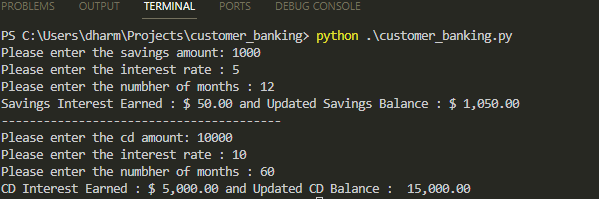

# customer_banking
Code repository for Module 3 Challenge Assignment
## Solution Overview
The customer_banking module requests information from the user through an input prompt. The values collected are
1. Savings Amount
2. Interest Rate
3. Savings Maturity (i.e. months)

Upon receiving the inputs, the customer_banking module calls the create_savings_account function by passing these parameters, and receives the updated savings amount balance and the interest earned for the period selected. The final savings account balance and savings interest earned are printed to the terminal.

Here interest rates are assumed to be simple interest rates and follows the known formula: interest = principal * (annual interest rate/ 100) * (number of months/12)

Similarly details for CD account are requested from the user, and the program (cd_create_account) in turn returns the updated balance and the interest earned. The three inputs requested are:
1. CD Amount
2. CD Interest Rate
3. CD Maturity (i.e. months)

The final CD account balance and CD interest earned are printed to the terminal.

Internally the create_savings_account and create_cd_function functions rely on class and methods provided in the Account class.

## Testing
Below is the sample test results:

